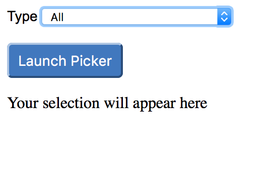
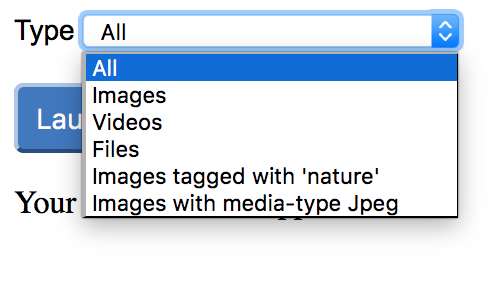

# Acoustic Content Palette
There are three sample applications provided in this repository that illustrate how to open the Acoustic Content (formerly Watson Content Hub) Palette from client JavaScript.

The first sample application contained within **index-inline.html** uses jQuery to login, open the Palette and choose an Asset. The second sample application contained within **index.html** extends this to also show how to customize which Assets are displayed.

These first two samples are built in JavaScript and HTML, and illustrate:

* Authenticating to Acoustic Content
* Launching the Acoustic Content Picker to view available assets.
* Returning the JSON definition of an asset from Acoustic Content

The third sample application contained within **index-delivery-content.html** combines three new modes of operation:

*	Launching the Acoustic Content Palette to select Content
*	Using the Acoustic Content Palette in ‘Delivery mode’ that doesn’t require authentication and only returns only published Assets and Content
* Using the Acoustic Content Palette in ‘Multi-select mode’ that allows more than one item to be selected at a time

### About the Acoustic Content Authoring APIs

The initial set of APIs provided by Acoustic Content are for Authoring services, which require authentication and are not optimized for retrieval by applications in production.

### About authentication

To call authenticated APIs, you need to first call the login service with the desired user name and password. This will return an authentication token cookie for use on subsequent calls. The browser will include the authentication token cookie in subsequent requests.

### Accessing the Acoustic Content Palette without authentication

The Acoustic Content Palette can also be launched to use the Delivery APIs that do not require authentication simply by adding a query parameter that references your API URL. Your API URL can be obtained from from the ‘Hub information’ dialog in the Content UI. For example: https://content-us.goacoustic.com/content-picker/picker.html?apiUrl=https://my2.digitalexperience.ibm.com/api/7b68b4ce-fb1c-4f33-bc5c-8b7881662107

 

By using the Palette in 'Delivery mode' you will benefit from using anonymous services that are also optimized for caching and performance. **Note** You will only see published Assets and Content returned.

For more information about using the Palette in ‘Delivery mode’, see https://developer.goacoustic.com/acoustic-content/docs/using-the-acoustic-content-palette-in-delivery-mode

### Using the Acoustic Content Palette to select more than one item

You can now select more than one Content Item or Asset at a time by launching the Palette in ‘Multi-select' mode. Enabling multi-select mode is as simple as adding a ‘multiSelect=true’ query parameter when launching the Palette. For example: https://content-us.goacoustic.com/content-picker/picker.html?multiselect=true

**Note** Using 'Multiselect mode' returns a JSON array instead of a single JSON object.

 

### Available parameters for the Palette

| Name | Example | Description |
|:-----|:--------------|:------------|
|carbon|true| Use latest look and feel while launching the palette.
|source|wch| Parameter indicates the media backend that should be used to query asset details. For e.g. source=wch,shutterstock means query from both Acoustic Content (formally WCH) and Shutterstock.
|multiselect| true | Enable multiple assets to be selected at the same time.
|multiSelectLimit| 3 | Maximum number of elements that can be selected when multiselect=true.
|isManaged| true | Parameter defines if managed assets (aka UI assets such as images, videos and files), unmanaged assets (aka web assets, such as HTML and JS files) or both needs to be displayed in the palette. Possible values are _true_, _false_ or _both_.
|assetUpload| true | Parameter determines whether the drag and drop asset upload box should be to displayed inside the palette.
|downloadAsset| true |  Parameter controls whether 3rd Party assets should be allowed to be downloaded into Content in the palette.
|fq| assetType:video | The solr search filter query to use to display items in the palette. There can be many of these. See below for some examples.

### About URLs to Assets

Accessing the unpublished Assets through the resource ID identifies a specific asset binary. This access point is provided by the authoring asset service API. **Note**: You must be authenticated to use the Authoring asset service APIs.

`https://{tenant-host}/api/{tenant-id}/authoring/v1/resources/{resource-id}`

`https://my.digitalexperience.ibm.com/api/1234c-4567e-890a-000b/authoring/v1/resources/3b09333ceffee0001`

The published versions of your Assets can be accessed from your delivery system through the following two entry points:

* Asset path
* Resource ID

Accessing the published asset through the asset path addresses your published resource as public static resource. The published asset is directly retrieved from the replicated storage infrastructure that is provided by Akamai. The published Assets get cached for one day on Akamai. This entry point provides the best performance for accessing your published assets.

`https://{tenant-host}/{tenant-id}/{asset-path}`

`https://my.digitalexperience.ibm.com/1234c-4567e-890a-000b/delivery/v1/resources/3b09333ceffee0001`

Accessing the published assets through the resource ID identifies a specific asset binary. This access point is provided by the delivery resource service API. You can find the corresponding API documentation in the [Acoustic Content API documentation](https://developer.goacoustic.com/acoustic-content/reference).

`https://{tenant-host}/api/{tenant-id}/delivery/v1/resources/{resource-id}`

`https://my.digitalexperience.ibm.com/api/1234c-4567e-890a-000b/delivery/v1/resources/3b09333ceffee0001`

### Running the sample

#### 1. Download the files

Clone or download the repository folder into any folder on your workstation. (Use [Clone or Download](https://help.github.com/articles/cloning-a-repository/) button on the Github repository home page).

#### 2. Update the user credentials and baseTenantUrl

This sample uses hard-coded user name, password, and baseTenantUrl values set in the pickerConsumer.js and pickerConsumerInline.js files in the public directory. Update the name and password values in those files. To avoid putting credentials in the source you could change the application to provide browser inputs for username and password.

The baseTenantUrl variables in pickerConsumer.js and pickerConsumerInline.js must also be set for your tenant. In the Acoustic Content user interface, click the "i" information icon at the top left of the screen next to where it says Acoustic Content. The pop-up window shows your host and tenant ID. Use this information to update the value of baseTenantUrl. For example it might look something like this:

const baseTenantUrl = "https://my12.digitalexperience.ibm.com/api/12345678-9abc-def0-1234-56789abcdef0";

For the 'Delivery mode' sample, you need to replace the {Host} and {Tenant ID} values in pickerConsumerDeliveryContent.js

#### 3.  Load sample HTML in a browser

You can do this right from the file system in Firefox, Chrome, or Safari browsers. Alternatively you can make the files available on any web server and open the html files in a browser using your web server URL.

The first sample (index.html) allows you to choose what type of assets to show (All / Images / Videos / Files) and then opens the Picker in
a dialog.

The second sample (index-inline.html) opens the picker in the same window and shows the expanded layout.

In both cases choose an image by clicking on the 'Click to add content' button as shown in screenshot and the JSON for that asset is returned to
the parent page.

The third sample (index-delivery-content.html) allows you to choose multiple published Content Items that are then displayed in a Bootstrap Carousel.

### Screenshots of the samples

#### 1. Open **index-inline.html** in a browser.

If you have updated the user credentials as described in the installation instructions then your assets are displayed.

Hover over an asset and an action bar appears allowing you to add your asset to the page:

When you choose an asset, the information about the asset is returned in JSON format. The delivery URL to that asset is also displayed. This URL is constructed using the x-base-tenant-url for the user and the path to the asset defined in the JSON.

  

#### 2. Open **index.html** in a browser.

A dropdown is shown which contains some options for customizing which items are displayed in the Picker.

All Assets: https://content-eu.goacoustic.com/content-picker/picker.html?*fq=classification:asset* or https://content-us.goacoustic.com/content-picker/picker.html?*fq=classification:asset*

Images:     https://content-eu.goacoustic.com/content-picker/picker.html?fq=classification:asset&*fq=assetType:image* or https://content-us.goacoustic.com/content-picker/picker.html?fq=classification:asset&*fq=assetType:image*

Videos:   https://content-eu.goacoustic.com/content-picker/picker.html?fq=classification:asset&*fq=assetType:video* or https://content-us.goacoustic.com/content-picker/picker.html?fq=classification:asset&*fq=assetType:video*

Files:  https://content-eu.goacoustic.com/content-picker/picker.html?fq=classification:asset&*fq=assetType:file* or https://content-us.goacoustic.com/content-picker/picker.html?fq=classification:asset&*fq=assetType:file*

Images tagged with 'nature':    https://content-eu.goacoustic.com/content-picker/picker.html?fq=classification:asset&*fq=assetType:image&fq=tags:(nature)* or https://content-us.goacoustic.com/content-picker/picker.html?fq=classification:asset&*fq=assetType:image&fq=tags:(nature)*

Images with media-type:     https://content-eu.goacoustic.com/content-picker/picker.html?fq=classification:asset&*fq=assetType:image&fq=mediaType:(image/jpeg)* or https://content-us.goacoustic.com/content-picker/picker.html?fq=classification:asset&*fq=assetType:image&fq=mediaType:(image/jpeg)*

  

Choose an option and click Launch Picker button. The Picker will open in a popup dialog. If you have updated the user credentials as described in the installation instructions then your assets are displayed.

 

 

 

 

 

 

When you choose an asset, the information about the asset is returned in JSON format. The delivery URL to that asset is also displayed. This URL is constructed using the x-base-tenant-url for the user and the path to the asset defined in the JSON.

 

#### 3. Open **index-delivery-content.html** in a browser.

 

Launch the Palette in 'Delivery mode' and select multiple Content Items. The JSON array is parsed and a Bootstrap Carousel is created to render the selected Content Items.

## Resources

Acoustic Content developer documentation: https://developer.goacoustic.com/acoustic-content/docs

Acoustic Content API reference documentation: https://developer.goacoustic.com/acoustic-content/reference

Acoustic Content Samples Gallery: https://content-samples.goacoustic.com/
